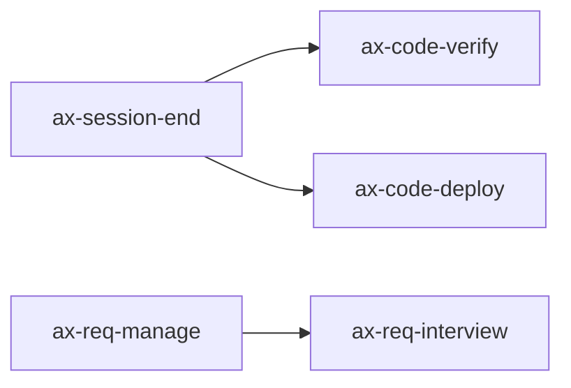

# Skill Framework Phase 3 — Design Document

> **Summary**: 기존 스킬 일괄 리팩토링(refactor.mjs) + 의존성 그래프(deps.mjs) + 10개 수동 분류 + threshold 수정의 기술 설계
>
> **Project**: AI Foundry
> **Version**: v0.6.0
> **Author**: Sinclair Seo
> **Date**: 2026-03-20
> **Status**: Draft
> **Planning Doc**: [skill-framework-3.plan.md](../01-plan/features/skill-framework-3.plan.md)

---

## 1. Overview

### 1.1 Design Goals

1. **리팩토링 자동화**: 22개 user+project 스킬의 lint 위반(gotchas 없음 22건, 폴더 구조 5건)을 분석·자동 scaffold
2. **의존성 시각화**: dependencies 필드 기반 Mermaid 그래프 + 순환 검출
3. **분류 100%**: 10개 미분류(중복 cache/marketplaces 4쌍 + example 1개) 수동 태깅
4. **Phase 2 잔여 해소**: threshold 기본값 0.3→0.2

### 1.2 Design Principles

- **비파괴적 기본**: `--dry-run`이 기본, `--fix`로 명시적 수정
- **기존 인프라 재사용**: lint-rules.json + classify.mjs + skill-catalog.json 패턴
- **외부 의존성 0**: Mermaid 텍스트 출력 (렌더링은 GitHub/viewer에 위임)

---

## 2. Architecture

### 2.1 Component Diagram

```
┌──────────────────────────────────────────────────┐
│  Phase 3 Additions                                │
│                                                    │
│  ┌─────────────┐  ┌──────────┐                    │
│  │refactor.mjs │  │ deps.mjs │                    │
│  │   [NEW]     │  │  [NEW]   │                    │
│  └──────┬──────┘  └─────┬────┘                    │
│         │               │                          │
│  ┌──────▼───────────────▼──────────────────────┐  │
│  │  skill-catalog.json (SSOT)                   │  │
│  │  + lint-rules.json (refactor 규칙 소스)       │  │
│  └──────────────────────────────────────────────┘  │
│                                                    │
│  ┌──────────────────────────────────────────────┐  │
│  │  scan.mjs [MODIFIED: threshold default 0.2]   │  │
│  └──────────────────────────────────────────────┘  │
└──────────────────────────────────────────────────┘
```

---

## 3. Module Specifications

### 3.1 refactor.mjs — 일괄 리팩토링 스크립트

```javascript
#!/usr/bin/env node
/**
 * refactor.mjs — Batch refactoring of user/project skills to match guidelines
 *
 * Usage:
 *   node skill-framework/scripts/refactor.mjs [--fix] [--dry-run] [--scope user|project|all]
 */
import { readFileSync, writeFileSync, existsSync, mkdirSync, appendFileSync } from 'node:fs';
import { resolve, join, dirname, basename } from 'node:path';
import { parseArgs } from 'node:util';
```

**CLI options:**
- `--fix`: 실제 파일 수정 (기본 false = dry-run)
- `--scope`: `user` | `project` | `all` (기본 `all`)
- `--catalog`: skill-catalog.json 경로

**주요 함수:**

```javascript
/**
 * 1) analyzeSkill(skill) → RefactorIssue[]
 *    - lint-rules.json 기반 위반 분석
 *    - 반환: { ruleId, severity, message, fixable, fixAction }
 *    - fixable 판단:
 *      - has-gotchas: fixable → gotchas scaffold 추가
 *      - folder-structure: fixable → references/ 디렉토리 생성
 *      - has-description: NOT fixable (사람이 작성해야 함)
 *      - description-trigger: NOT fixable
 *      - single-category: fixable (기존 lint --fix 로직 재사용)
 */

/**
 * 2) fixGotchas(skillPath) → boolean
 *    - 스킬 파일 끝에 gotchas scaffold 추가:
 *    ```markdown
 *    ## Gotchas
 *    - TODO: 이 스킬 사용 시 주의사항을 작성하세요
 *    ```
 *    - 이미 gotchas가 있으면 skip (false 반환)
 *    - command(.md 파일): 파일 끝에 append
 *    - skill(SKILL.md): SKILL.md 끝에 append
 */

/**
 * 3) fixFolderStructure(skillDir) → boolean
 *    - references/ 디렉토리가 없으면 생성 + README.md scaffold
 *    - command type은 skip (단일 파일이므로 폴더 구조 불필요)
 */

/**
 * 4) generateReport(results) → string
 *    - Markdown 리포트 생성
 *    - 포맷:
 *    ```
 *    ## Refactoring Report
 *    | Skill | Issues | Fixable | Fixed | Status |
 *    |-------|:------:|:-------:|:-----:|:------:|
 *    | ax-session-end | 2 | 1 | 1 | PARTIAL |
 *    ```
 */

/**
 * 5) main()
 *    - catalog 로드 → user+project 필터 → analyzeSkill 각각
 *    - --fix 시: fixGotchas + fixFolderStructure 실행
 *    - 리포트 출력
 */
```

**gotchas scaffold 예시:**

```markdown

---

## Gotchas

- TODO: 이 스킬 사용 시 주의사항을 작성하세요
```

### 3.2 deps.mjs — 의존성 그래프 CLI

```javascript
#!/usr/bin/env node
/**
 * deps.mjs — Skill dependency graph and cycle detection
 *
 * Usage:
 *   node skill-framework/scripts/deps.mjs graph [--format mermaid|table]
 *   node skill-framework/scripts/deps.mjs check
 *   node skill-framework/scripts/deps.mjs list [--skill skillId]
 */
import { readFileSync } from 'node:fs';
import { resolve } from 'node:path';
```

**서브커맨드:**

#### 3.2.1 `graph` — Mermaid 다이어그램 생성

```javascript
/**
 * graph(format)
 * 1. skill-catalog.json 로드
 * 2. dependencies[] 필드가 있는 스킬만 추출
 * 3. Mermaid flowchart 생성:
 *    ```mermaid
 *    graph LR
 *      ax-session-end --> ax-code-verify
 *      ax-session-end --> ax-git-sync
 *    ```
 * 4. dependencies 없는 스킬은 isolated node로 표시 (선택)
 * 5. --format table: Markdown 테이블 출력
 */
```

출력 예시:
```
📊 Skill Dependency Graph
─────────────────────────

Skills with dependencies: 3/22
Skills without: 19/22 (⚠️ undeclared)
```

#### 3.2.2 `check` — 순환 의존성 검출

```javascript
/**
 * check()
 * 1. adjacency list 구축 (skill → dependencies[])
 * 2. DFS로 cycle detection (visited + recursion stack)
 * 3. 순환 발견 시: cycle path 출력 + exit(1)
 * 4. 순환 없으면: "✅ No circular dependencies" + exit(0)
 */
```

#### 3.2.3 `list` — 의존성 테이블

```javascript
/**
 * list(skillId?)
 * 1. 전체 또는 특정 스킬의 의존성 정보 테이블 출력
 * 2. | Skill | Dependencies | Depended By |
 */
```

### 3.3 scan.mjs — threshold 기본값 수정

```javascript
// 변경 전 (line 32):
const threshold = parseFloat(getArg('threshold', '0.3'));

// 변경 후:
const threshold = parseFloat(getArg('threshold', '0.2'));
```

### 3.4 skill-catalog.json — 10개 수동 분류

현재 미분류 10개 분석:

| 스킬 ID | description 키워드 | 적합 카테고리 |
|---------|------------------|-------------|
| cache:bkend-storage | file storage, upload, download | code-scaffolding |
| cache:claude-code-learning | learning, configure, setup | code-scaffolding |
| cache:dynamic | fullstack, BaaS, authentication | code-scaffolding |
| cache:phase-6-ui-integration | UI, API integration, state | code-scaffolding |
| cache:swot-analysis | SWOT, strengths, weaknesses | requirements-planning |
| marketplaces:bkend-storage | (cache와 동일) | code-scaffolding |
| marketplaces:claude-code-learning | (cache와 동일) | code-scaffolding |
| marketplaces:dynamic | (cache와 동일) | code-scaffolding |
| marketplaces:phase-6-ui-integration | (cache와 동일) | code-scaffolding |
| example-plugin:example-command | example, demonstrates | code-scaffolding |

**참고**: cache:* 와 marketplaces:* 가 4쌍 중복 (같은 플러그인의 캐시/마켓플레이스 경로). 모두 분류하면 uncategorized 0개.

---

## 4. Error Handling

| 상황 | 동작 | 종료 |
|------|------|:----:|
| 스킬 파일 읽기 실패 | 경고 + skip | 계속 |
| gotchas append 실패 | 경고 + skip | 계속 |
| references/ 생성 실패 | 경고 + skip | 계속 |
| catalog 로드 실패 | 에러 + exit(1) | 종료 |
| 순환 의존성 발견 | cycle path 출력 + exit(1) | 종료 |

---

## 5. File Structure

### 5.1 신규 파일 (2개)

| 파일 | 줄 수(예상) | 역할 |
|------|:----------:|------|
| `scripts/refactor.mjs` | ~120 | 일괄 리팩토링 (분석 + --fix 교정 + 리포트) |
| `scripts/deps.mjs` | ~100 | 의존성 그래프 (graph + check + list) |

### 5.2 변경 파일 (3개)

| 파일 | 변경 내용 |
|------|----------|
| `scripts/scan.mjs` | threshold 기본값 `'0.3'` → `'0.2'` (1줄) |
| `data/skill-catalog.json` | 10개 uncategorized → 카테고리 배정 |
| `scripts/scan.test.mjs` | +7건 테스트 추가 (43→50) |

---

## 6. Test Plan

### 6.1 테스트 범위

| 모듈 | 테스트 수 | 테스트 대상 |
|------|:--------:|----------|
| refactor.mjs | 3 | analyzeSkill 위반 감지, fixGotchas scaffold 추가, generateReport 포맷 |
| deps.mjs | 3 | graph Mermaid 생성, check 순환 검출, list 테이블 출력 |
| threshold | 1 | scan.mjs 기본 threshold 0.2 확인 |
| **합계** | **7** | 기존 43 + 7 = **50** |

### 6.2 테스트 케이스

```javascript
// === refactor.mjs ===
test('refactor: analyzeSkill detects missing gotchas', () => { ... });
test('refactor: fixGotchas appends scaffold to file', () => { ... });
test('refactor: generateReport returns markdown table', () => { ... });

// === deps.mjs ===
test('deps: graph generates mermaid flowchart', () => { ... });
test('deps: check detects circular dependency', () => { ... });
test('deps: list shows dependency table', () => { ... });

// === threshold ===
test('scan: default threshold is 0.2', () => { ... });
```

---

## 7. Agent Team Work Division

### 7.1 W1: 리팩토링 + 수동분류 (2 파일)

| 파일 | 작업 |
|------|------|
| `scripts/refactor.mjs` | 신규 생성 (~120줄) |
| `data/skill-catalog.json` | 10개 uncategorized 수동 분류 |

### 7.2 W2: 의존성 + threshold + 테스트 (3 파일)

| 파일 | 작업 |
|------|------|
| `scripts/deps.mjs` | 신규 생성 (~100줄) |
| `scripts/scan.mjs` | threshold 1줄 변경 |
| `scripts/scan.test.mjs` | +7건 테스트 추가 |

### 7.3 구현 순서

```
Phase 1 (병렬): W1 + W2 동시 실행
  W1: refactor.mjs + catalog 수동 분류
  W2: deps.mjs + scan.mjs threshold + tests

Phase 2 (리더): 검증
  - 50/50 테스트 PASS 확인
  - scan --auto-classify → 분류율 100% 확인
  - File Guard 결과 확인
```

---

## 8. Implementation Checklist

1. [ ] `scripts/refactor.mjs` 구현 (analyzeSkill + fixGotchas + fixFolderStructure + report)
2. [ ] `scripts/deps.mjs` 구현 (graph + check + list)
3. [ ] `data/skill-catalog.json` 10개 수동 분류
4. [ ] `scripts/scan.mjs` threshold 0.3→0.2
5. [ ] `scripts/scan.test.mjs` 7건 테스트 추가
6. [ ] 전체 테스트 실행 (50/50 PASS)
7. [ ] 분류율 100% 확인

---

## Version History

| Version | Date | Changes | Author |
|---------|------|---------|--------|
| 0.1 | 2026-03-20 | Initial Phase 3 design | Sinclair Seo |
